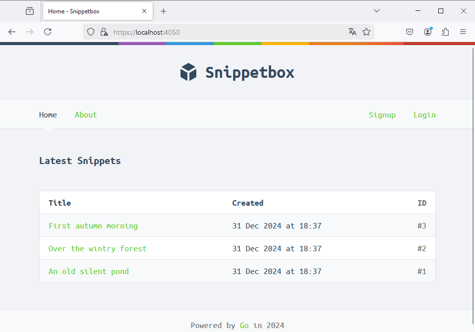

# Snippetbox
Aplicación para guardar snippets de texto. Hecha con Go y MySQL.
Inspirada en [LET'S GO by Alex Edwards](https://lets-go.alexedwards.net/).

# Installation

Run `make app/install`. It creates the database and the PEM certificate (for development purposes).

# Usage
Run `make app/run`

